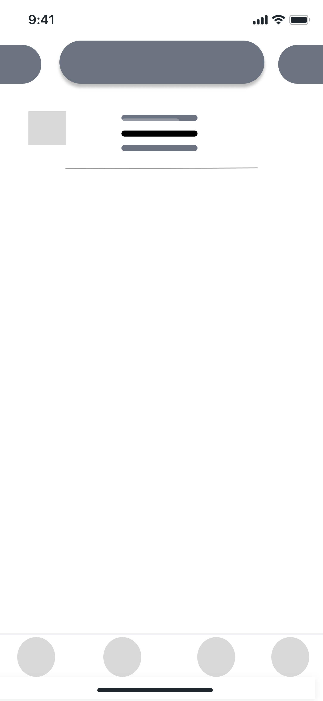
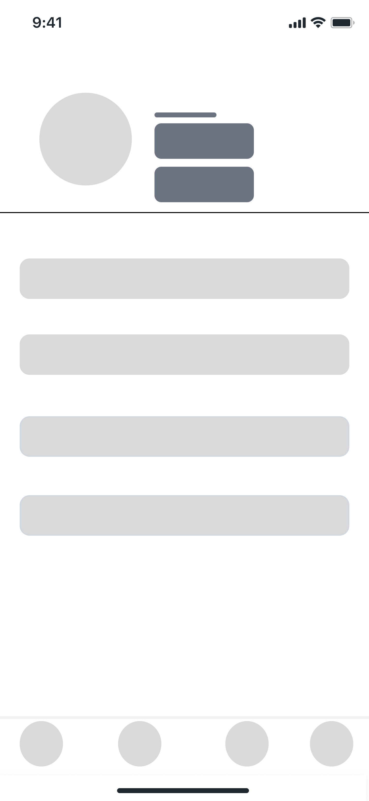
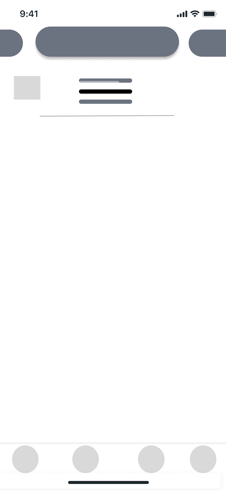

# 🚀 GO-FLASH

Selamat datang di repositori **GO-FLASH**, aplikasi kurir kilat yang dirancang untuk memberikan pengalaman pengguna yang cepat, sederhana, dan efisien.

---

## 🎨 UI/UX Design

Bagian ini berisi seluruh aktivitas yang berkaitan dengan **perancangan antarmuka (UI)** dan **pengalaman pengguna (UX)**. Tujuannya adalah menciptakan tampilan visual yang menarik, fungsional, dan mudah digunakan oleh pengguna akhir.

### 🔧 Aktivitas Utama
- Pembuatan wireframe & mockup (low fidelity & high fidelity)
- Desain komponen UI: ikon, tombol, warna, tipografi
- Pengembangan user flow yang sederhana & intuitif
- Penyesuaian desain berdasarkan hasil feedback pengguna
- Kolaborasi dengan tim pengembang untuk implementasi desain

### 🛠️ Tools yang Digunakan
- 🎨 [Figma](https://www.figma.com/) — untuk desain antarmuka dan prototyping
- ✅ [Trello](https://trello.com/b/your-trello-board-link) — untuk manajemen tugas dan kolaborasi tim

# 🚀 GO-FLASH

Selamat datang di repositori **GO-FLASH**, aplikasi kurir kilat yang dirancang untuk memberikan pengalaman pengguna yang cepat, sederhana, dan efisien.

---

## 🎨 UI/UX Design

Bagian ini berisi seluruh aktivitas yang berkaitan dengan **perancangan antarmuka (UI)** dan **pengalaman pengguna (UX)**. Tujuannya adalah menciptakan tampilan visual yang menarik, fungsional, dan mudah digunakan oleh pengguna akhir.

### 🔧 Aktivitas Utama
- Pembuatan wireframe & mockup (low fidelity & high fidelity)
- Desain komponen UI: ikon, tombol, warna, tipografi
- Pengembangan user flow yang sederhana & intuitif
- Penyesuaian desain berdasarkan hasil feedback pengguna
- Kolaborasi dengan tim pengembang untuk implementasi desain

### 🛠️ Tools yang Digunakan
- 🎨 [Figma](https://www.figma.com/) — untuk desain antarmuka dan prototyping
- ✅ [Trello](https://trello.com/b/your-trello-board-link) — untuk manajemen tugas dan kolaborasi tim

> Pastikan setiap desain divalidasi dengan uji coba pengguna dan konsisten dengan _design guideline_ yang disepakati bersama.

---

## 🧭 Storyboard

Berikut adalah gambaran storyboard dari aplikasi **GO-FLASH**, mulai dari pengguna membuka aplikasi hingga melakukan proses pemesanan jasa kurir:
# GO-FLASH – UI/UX Design

## 📌 Tujuan
Repositori ini berisi seluruh aktivitas dan dokumentasi terkait proses perancangan antarmuka pengguna (UI) dan pengalaman pengguna (UX) dari aplikasi *GO-FLASH*. Fokus utama adalah menciptakan tampilan yang **menarik**, **mudah digunakan**, dan **konsisten** untuk pengguna akhir.

---

## 🎨 Kegiatan UI/UX

- 🧠 Perancangan wireframe & mockup (Low Fidelity & High Fidelity)
- 🎨 Desain komponen UI (ikon, tombol, warna, tipografi)
- 🔁 Pengembangan dan evaluasi user flow
- 🧪 Validasi desain melalui uji coba pengguna
- 🤝 Kolaborasi dengan tim pengembang untuk implementasi

---

## 🧰 Tools yang Digunakan

| Tool      | Fungsi                            |
|-----------|------------------------------------|
| **Figma** | Desain antarmuka dan prototyping   |
| **Trello**| Manajemen tugas dan kolaborasi tim |

🔗 Trello Board: [Klik di sini](https://trello.com/invite/b/67d12ded6df39be85f4c10dd/ATTI5cd6b2d460ea020cec3cc93520b2d8c67BB03056/pemrograman-mobile) *(ganti dengan link Trello sebenarnya)*

---

## 🗺️ Storyboard

Berikut adalah storyboard utama dari alur pengguna dalam aplikasi GO-FLASH:

### 1. Status Pesanan

### 2. Detail Pesanan

### 3. Diproses

### 4. Lacak Kurir

### 5. Permintaan Pickup

### 6. Pesanan Baru

### 7. Pesanan Baru 1

### 8. Profile Pengguna

### 9. Riwayat Pengiriman

### 10. Selesai

### 11. Layanan Customer Service

---

## 📌 Tautan Terkait

- 🎯 [Proyek Trello Kami](https://trello.com/invite/b/67d12ded6df39be85f4c10dd/ATTI5cd6b2d460ea020cec3cc93520b2d8c67BB03056/pemrograman-mobile) – lihat progress dan pembagian tugas tim
- 📁 Folder Desain Figma: _sertakan link di sini jika tersedia_
- 💡 _Jika ingin kontribusi, pastikan baca guideline kontribusi terlebih dahulu._

---

> _Dibuat dengan ❤️ oleh Tim UI/UX GO-FLASH_
